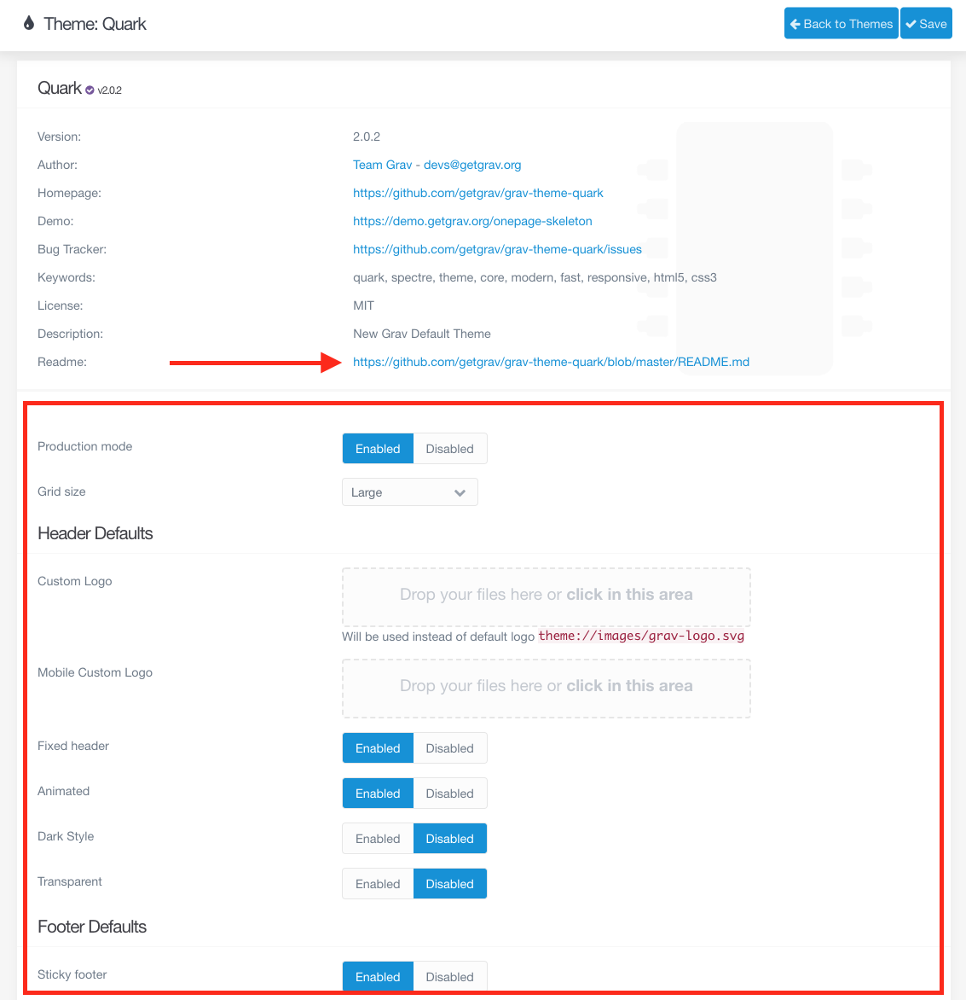
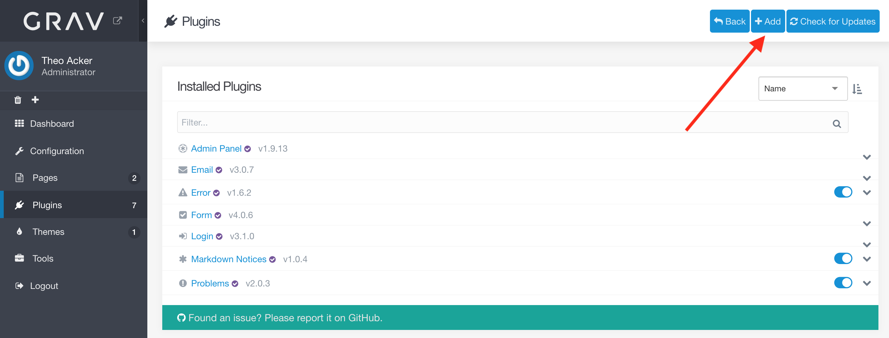
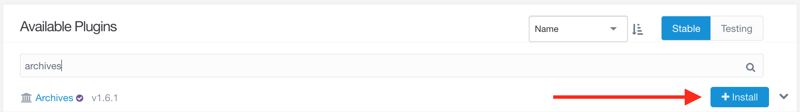
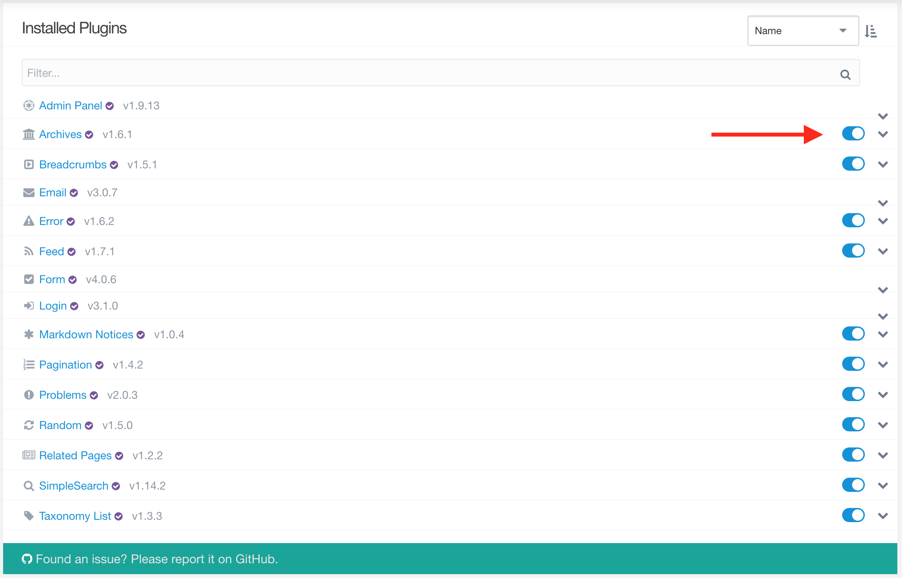

Themes and plugins are both very important. Every website has one theme, which defines how the site looks and feels. The theme may also interact with various plugins, such as by adding a search bar if the plugin _SimpleSearch_ is enabled. There are many available plugins, each of which adds some type of functionality to your website. In fact, the admin panel we are using is actually a plugin itself.

! When going to add themes or plugins, if you get a message that you cannot connect to the gpm, you probably need to update Grav.

## Themes

There are a lot of available themes, but for this tutorial we will use the robust and versatile default theme, _Quark_. It is worth noting the configuration options available for the theme, although we will not be changing any at the moment. To view these options, start by going to the _Themes_ tab on the administration panel.

Clicking on the _Quark_ theme will show us the information page for that theme (including a link to a Readme file containing more detailed information), along with any available configuration options. For now we will leave them as we are, but you may find you want to change these later.

!!!! Themes will be covered in more detail in the mini tutorials.

## Plugins

Some themes support certain plugins. Common suspects include _Breadcrumbs_, _Pagination_, _SimpleSearch_, _Taxonomy List_, and _TNT Search_. There are also many plugins that do not require theme support. The best way to find out how to use a plugin is to look through the provided Readme. Ideally your chosen theme will have a detailed Readme that lists supported plugins. If it does not, you can test some of the most common plugins and see if any of your pages change when you add them.

!!! The [Plugins chapter](https://learn.getgrav.org/16/plugins) in the Grav documentation is very technical, but you may want to check out the section on plugins in the [Adminstration Panel chapter](https://learn.getgrav.org/16/admin-panel/plugins).

Unfortunately, while the Readme for _Quark_ is very helpful, it does not describe what plugins it automatically supports. However, we will install several of the most commonly supported plugins.

To start with, we will need to go to the _Plugins_ tab on the admin panel and then click the _Add_ button.

[ui-browser address="http://ds-tutorials.oucreate.com/grav-demo/admin/plugins"]

[/ui-browser]

Since there are a lot of plugins, it is easiest to search for a plugin you know you want by typing in the name. We will start with the _Archives_ plugin. As we accumulate blog posts (or other content), this plugin will make it easier for website visitors to view older content.

When the installation has finished, the admin panel will take us to the information and configuration page for the plugin, just like it did when we installed the theme. Again, you will see both a link to the Readme for the plugin and the various configuration options available. Now we have to install the _Breadcrumbs_, _Feed_, _Pagination_, _Random_, _Related Pages_, _SimpleSearch_, and _Taxonomy List_ plugins. These are installed exactly the same way that we installed _Archives_. For more information on what these plugins do, please read the Readmes.

Those are quite a few plugins, especially if you are not sure what they do yet. One easy option for experimenting with how they affect the website and theme interactions is to toggle the plugins on and off. However, we will need to add content to the website before that does anything useful for us.

