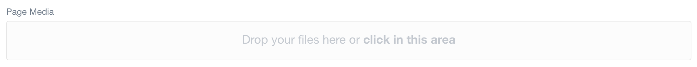
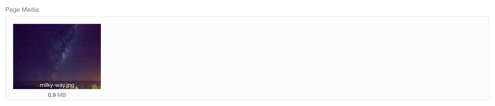
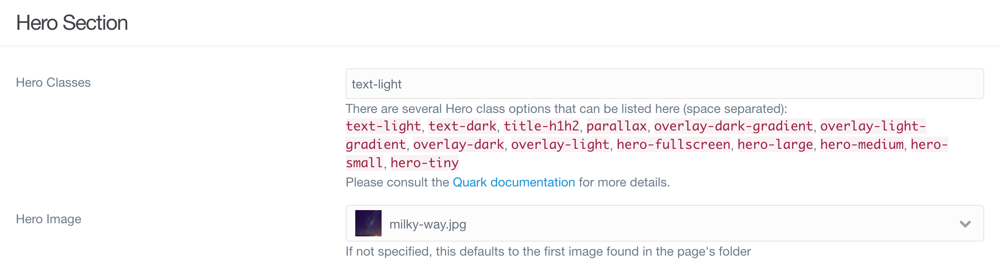
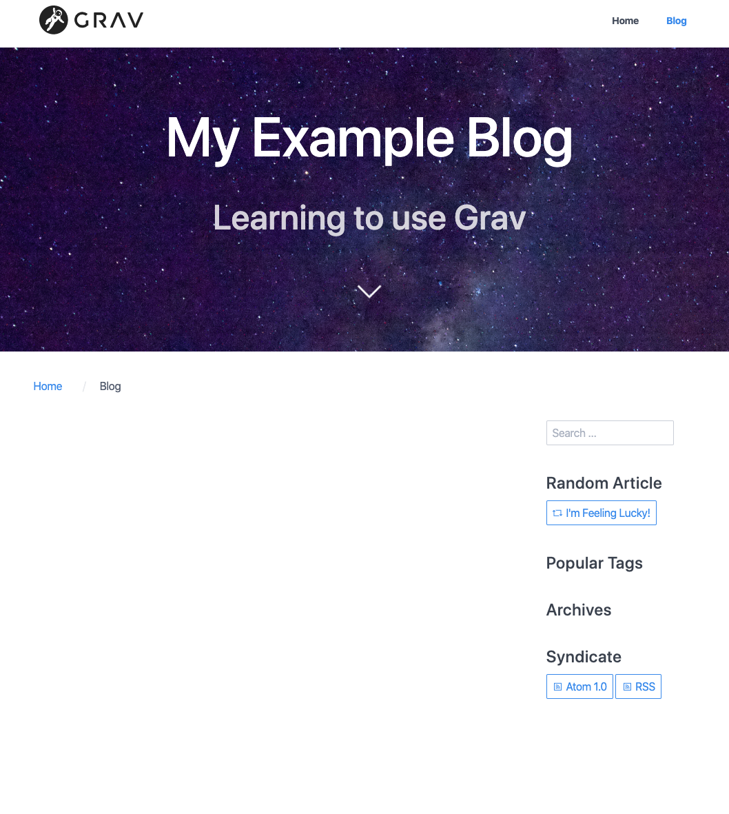

There are two main ways you can add images to your pages. The first is to include an image directly in your content. We will do this in one of our blog posts.

The other way is to add media to a page with a template that supports showing media. _Blog_ is one such template. At the moment, since no media has been added, the page content (the header and sub-header we added) is displayed on a blank background. If we add an image to the page, that image will become the background instead.

## Media Used in This Tutorial

The photos I use in this tutorial are available from [Flickr](https://www.flickr.com/photos/theodwynn/albums/72157712814676952). You are welcome to download and use these for the tutorial.

! When downloading images I always choose the _Original Size_ option to get the best quality image. You can choose any size you like, but keep in mind that the lower the size, the lower the quality. I also changed all of my images to .png instead of .jpg after downloading. This is because .png images do not lose quality when they are compressed.

## Adding Images

Whether we are including an image within our content as we will do later or adding an image to be used by the page template, we first have to add the image to the page itself. On the _Blog_ page, at the bottom of the _Content_ tab, there is a place to add media.

! Note that the Page Media section will not initially be available on a new page. Any new page must be saved first before images can be added. This is because Grav will not create the page folder until after the first save, but that folder is where images uploaded to the page are saved.

When we have added and saved an image, the content editor will show it in the media box.

### Option 1: Including an image directly in the content

In many cases, having added an image to the Page Media section would not cause any changes on the page itself. In this case, because the _Blog_ template supports adding an image, all we need to do is configure our settings in the _Blog Config_ tab. However, if we wanted to add the image within the content, we still could do that as well. In general, if a template supports an image, the only time we would also want to add one to the content is if we were using more than one. We will actually add an image to our content in one of the sample blog posts, but in case you are curious now, here are the instructions.

The Markdown for adding an image looks like ``. If the media has been added to the page that is using it (by uploading it the same way you would before setting it as the hero image), the url can simply be the name of the image, like this: `` or ``. If you are using an image located elsewhere on your website you will need to provide either the full url or the relative url (for example, `image.png` and `./image.png` are relative urls). I strongly recommend uploading the images you use directly to the page (or to a seperate folder on your website). An image posted elsewhere on the internet might be taken down at some point, leaving you with a broken image link.

! Please note the _alt text_ (or alternative text) section in the Markdown for adding an image. It is extremely important to provide good alt text for any image you add to your content. If the image is ever removed, the broken link will display the alt text instead, allowing users to at least know what used to be there. More importantly, visually impaired users can benefit from good alt text, since they may not be able to make use of the image itself.

### Option 2: Adding template-specific media

As mentioned above, we do not need to use Markdown to add this image to our content. Instead, we need to modify our settings in the _Blog Config_ tab. Specifically, we need to go to the Hero Section in the tab.

Since the image I chose is rather dark, it does not make sense to pair it with dark text. I will therefore add the Hero Class _text-light_. If you chose a dark picture like I did, you will also be in this situation. Sometimes you might want to pair _overlay-dark-gradient_ with the _text-light_ class. The other typical combination would be _text-dark_ and _overlay-light-gradient_. The overlays can make the image a bit darker or lighter, making it easier for the light or dark text to show up clearly.

We can also explicitly set the image we added as the hero image to be used by the template, although it should automatically use the first image it finds.

The page now looks a lot nicer.

[ui-browser address="http://ds-tutorials.oucreate.com/grav-demo/blog"]

[/ui-browser]

!!!! Occasionally you may have an image large enough that it causes issues when you try to add it in the admin panel. You can learn more about changing media settings in a future mini tutorial.