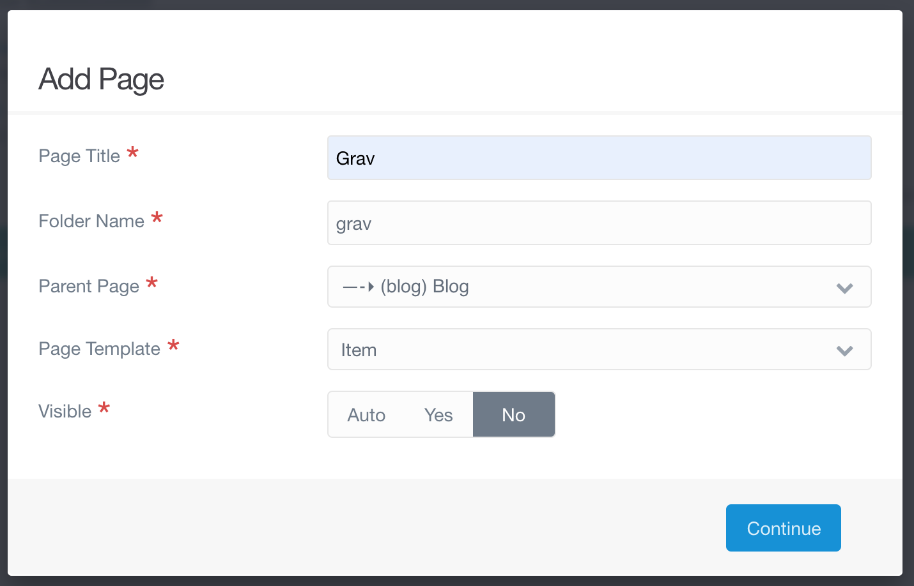

No blog would be complete without posts. The template for a blog post is the _Item_ template. We can create a new page for our post the same way we added a blog page.



I decided to name the first post _Grav_ since we are talking about how to use Grav. As before, the folder name is automatically generated, but this time we need to change the parent page from `NOCLIP \ (root)` to `NOCLIP (blog) Blog`. If we added the page to the root of our website it would show up as another page like _Home_ and _Typography_. Adding it to _Blog_ makes it a sub-page of that page, and because the _Blog_ template references a collection of its children (sub-pages), our new page will be displayed on our blog.

We also need to change the page template from _Blog_ to _Item_ and to set the page not to be visible. Visibility determines whether or not the page is displayed in the navigation. If we set the post to be visible, then mousing over the word _Blog_ in our navigation bar will display a dropdown menu we can use to access the page.


The dropdown seems relatively unobtrusive with just the one post, but if we continue adding posts it will quickly grow out of hand. Instead, we want to access our pages through the main blog page. Making the page invisible will not prevent it from showing up there.

## Content

Since the title of our first post is _Grav_, we should probably write something about Grav in the content. We can start by using the markdown syntax for a header.

```md
CLIP: ## What is Grav?

```

Then we can answer our question with some information from the [Grav page](http://grav.ds-tutorials.oucreate.com/overview/grav) in this tutorial. Markdown blockquotes are written using the `>` symbol.

```md
CLIP: To quote the Grav documentation:

> Grav is a **Fast**, **Simple**, and **Flexible** file-based Web-platform.
> 

If you have heard of Wordpress, Grav is very similar. It streamlines website building, allowing users to create their own without requiring previous coding knowledge or experience.

```

To add a fancy blue box with the link to the Grav documentation we can make use of the _Markdown Notices_ plugin that was automatically added when we installed Grav. There are yellow, red, blue, and green notices. The color/type of notice is determined by the number of exclamation points we put before it. Since blue is the third color, we need to use three exclamation points.

```md
CLIP: !!! The Grav documentation is very extensive. It is available **[here](https://learn.getgrav.org/16**).

```

The link at the end is enclosed with asterisks `**` so that it will be displayed with bold text to make it stand out better. The link format is `[text-to-display](url)`.

This what the editor will look like when we have added the content above.


## Media

Like _Blog_, the _Item_ template supports adding an image as a header. As before, images used in this tutorial are available [here](https://www.flickr.com/people/theodwynn/).

Along with the image, I will add some credit information in the content. It is important to always give credit for any images you use!

```md
CLIP: ### Photo Credit

Rainbow over glacier, New Zealand by [Wendy Acker](https://www.flickr.com/people/theodwynn/), [CC BY-NS-SA 4.0](https://www.creativecommons.org/licenses/by-nc-sa/4.0/)
```


## Tags

Finally, many blogs use tags to indicate what individual posts are about. _Quark_ supports this, especially if the _Taxonomy List_ plugin is activated. We can add tags to our post in the _Options_ tab. We start by typing in the tag we want to use.


Pressing enter/return creates the tag. We can continue making as many tags as we want.


The tags will be stored in the frontmatter of the page they are added to. If we switch to expert mode, the tags we just added will look something like this:

```yaml
CLIP: taxonomy:
    tag:
        - grav
        - tutorial
        - 'landscape photo'
        - 'new zealand'
```

If we take a look at our website, we can see our new post.

[ui-browser address="http://ds-tutorials.oucreate.com/grav-demo/blog"]

[/ui-browser]

## Potential Issues

We can click on the post to switch to that page.

[ui-browser address="http://ds-tutorials.oucreate.com/grav-demo/blog/grav"]

[/ui-browser]

Unfortunately, while the image we added shows up on the main blog page, it is not showing up in the post itself. This does seem odd, since the hero image is supposed to default to the first image in the page's media if no image is set, but the reality with working with technology is that we will often encounter odd-seeming situations. There may be perfectly reasonable explanations that we can easily find out, or we may never know for certain why a particular thing does or does not work. That is okay. We will try explicitly defining our hero image.

Since the photo is kind of dark, we could do what we did for our blog page and add the hero class _text-light_. For this and future posts, I am actually going to include three classes: _title-h1h2_, _text-light_, and _overlay-dark-gradient_. Using the same classes for all posts will make the blog visually consistent. Since I am overlaying the image with a dark gradient, the light text should show up well, even if the picture isn't initially super dark. The first class, _title-h1h2_, changes the style of the heading text.

! Note that for the _Blog_ template, the tab with the above options is called _Blog Config_. For the _Item_ template, this tab is called _Blog Item_.


Now when we click on the post (or refresh the page) the image appears.

[ui-browser address="http://ds-tutorials.oucreate.com/grav-demo/blog/grav"]

[/ui-browser]

## Summaries

On the blog page, the item card for our new post is rather long. By default, Grav determines a certain summary size and displays that amount of content from each post on the main blog page. We can change the summary settings in the _Blog Item_ tab in the page editor, but that could quickly grow tedious. A more versatile way to define summary size is by including a summary delimiter `===` in the page content. When adding the delimiter, we need to make sure we have an empty line in front of it and an empty line after it so that Grav can easily establish that we are using it as a summary delimiter.

The summary delimiter tells Grav to end the summary at this point if the summary has not yet reached its max length. It will not show up in the summary itself or in the actual page content.


Now when we go to our blog page we can see that the card is shorter, since the summary ends as soon as it reaches the delimiter we added.

[ui-browser address="http://ds-tutorials.oucreate.com/grav-demo/blog"]

[/ui-browser]