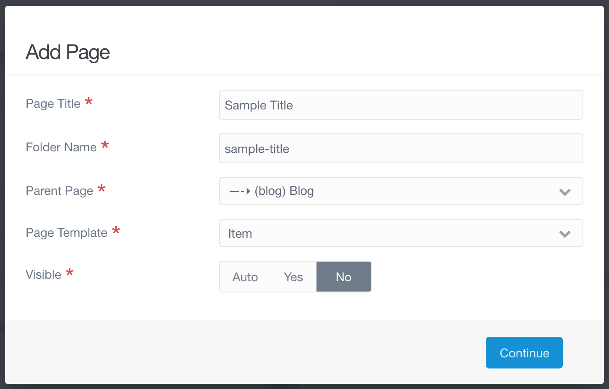

We should add several more posts to our blog so we can see how it will look when it is all put together.

You can make your own posts if you like, but I have provided several sample posts that you can use as well. You can follow along on this page to make each of these posts.

!!!! A sample repository is in the works where you will also be able to download these pages and upload them to your website using the file manager, instead.

## The Posts

Remember for each of these to use the _Item_ template, to not make the page visible, and to set the parent page to _(blog) Blog_, as below.



The following details will be provided for each page:
- Content Tab
  - Title
  - Content (for the Markdown editor)
  - Page Media

- Options Tab
  - Tags (both a list of tags and the yaml text that would go into the Frontmatter)

- Item Config Tab
  - Hero Classes
  - Hero Image

- Frontmatter

The Frontmatter section will provide the yaml text that would go into the Frontmatter if you are using Expert mode. If you choose to use Expert mode, all you have to do is upload any images specified to the Page Media, copy the Content into the Markdown editor, and copy the Frontmatter.

### 1. Media in Markdown

#### Cotent

Title: `CLIP: Media in Markdown`

Content:

```md
CLIP: As mentioned in the [tutorial](http://ds-tutorials.oucreate.com/base-tutorial/content/media), there are two ways to add images to your pages. The tutorial walks you through uploading an image and then setting it as the "hero image" used by the page template. It also provides a brief description of adding images within the content. In this post we will demonstrate adding an image within the content.


Total Solar Eclipse 2017, Wyoming by [Wendy Acker](https://www.flickr.com/people/theodwynn/), [CC BY-NS-SA 4.0](https://creativecommons.org/licenses/by-nc-sa/4.0/)

The Markdown for adding an image looks like . If the media has been added to the page that is using it (by uploading it the same way you would before setting it as the hero image), the url can simply be the name of the image, like this:  or . If you are using an image located elsewhere on your website you will need to provide either the full url or the relative url (for example, image.png and ./image.png are relative urls). I strongly recommend uploading the images you use directly to the page (or to a seperate folder on your website). An image posted elsewhere on the internet might be taken down at some point, leaving you with a broken image link.

! Please note the alt text (or alternative text) section in the Markdown for adding an image. It is extremely important to provide good alt text for any image you add to your content. If the image is ever removed, the broken link will display the alt text instead, allowing users to at least know what used to be there. More importantly, visually impaired users can benefit from good alt text, since they may not be able to make use of the image itself.

Note that for this post, there is only one piece of media added. The blog page displays the image on the summary, but the post page does not show the image as a header/hero. If you do not want to use a header image, but still want to show an image with your post, this is an excellent way to do so.
```

Page Media:
- Total Solar Eclipse 2017, Wyoming as eclipse-2017.png

#### Options

Tags:
- tutorial
- markdown
- astronomy

#### Item Config

Hero Classes: none

Hero Image: none

#### Frontmatter

```yaml
CLIP: taxonomy:
    tag:
        - tutorial
        - markdown
        - astronomy
```