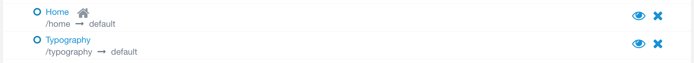
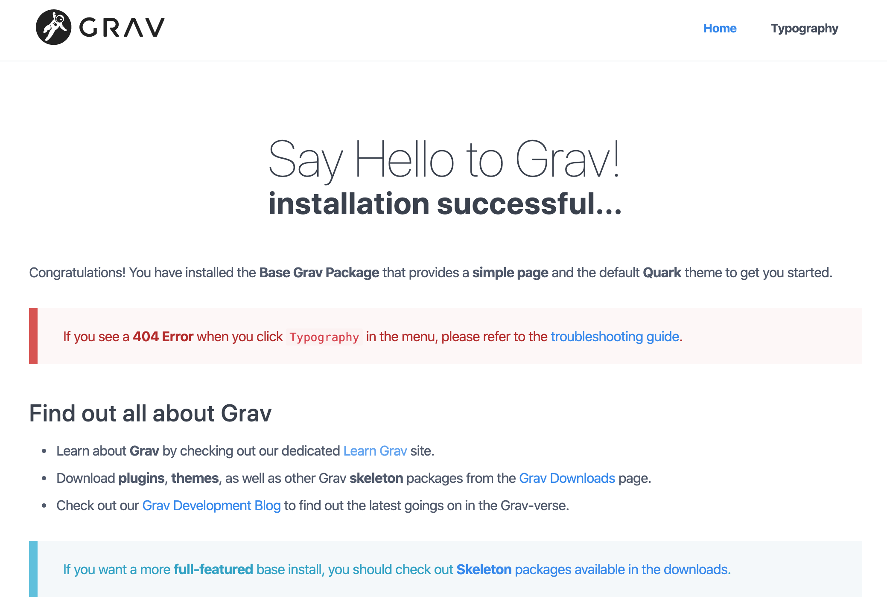
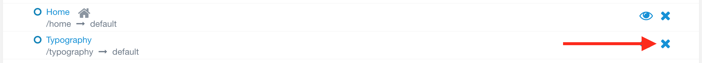

Content will be added through the _Pages_ tab on the admin panel. The Grav installation starts us out with two default pages: _Home_ and _Typography_.

If we open a new tab showing our website, we can see that the default looks pretty boring.

[ui-browser address="http://grav.ds-tutorials.oucreate.com/grav-demo/blog"]

[/ui-browser]

To start, we will remove the _Typography_ page on the admin panel using the blue X. The _Typography_ page provides information about markdown, which we do not need as part of our website.

!!!! The _Home_ page is also unnecessary for our website. This will be removed and replaced in a future mini tutorial.

