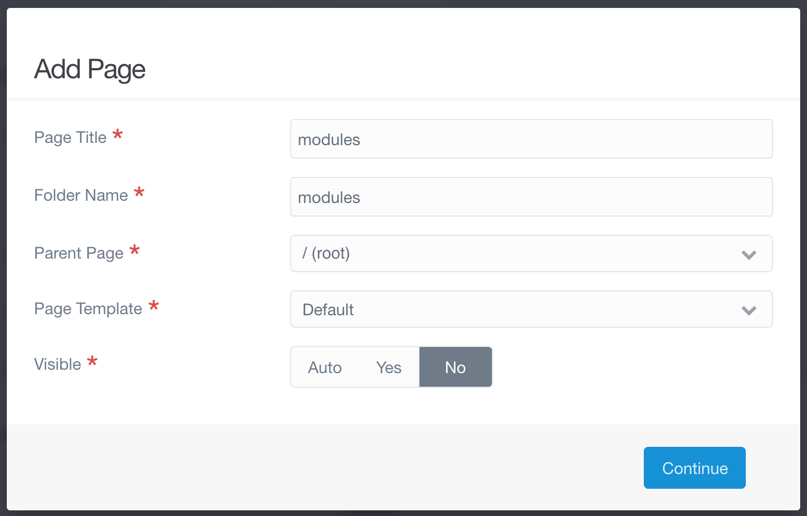

Now that we have a set of sample posts to work with there are only a few more things to do before we have a properly functional blog.

## Organization

By default Grav sorts all the blog posts alphabetically. With only eleven posts this is not too bad, but it could easily become very annoying to navigate as we create more and more posts.


! To view a list of all your pages, go to the _Pages_ tab in the admin panel and click on the _plus_ icon next to _Blog_. This is your current folder structure.

Because we are writing a blog, it would make sense to have our most recent posts at the top of the list, as they are the most likely ones we would want to edit. Fortunately, the admin panel provides a straightforward way to do this.

1. From _Pages_, go to the _Blog_ folder and click on the _Advanced_ tab.
2. Find _Children Display Order_. It is the only option under the very last section called _Admin Specific Overrids_.
3. The dropdown menu has two options. Choose _Ordered by Collection definition_.


The blog displays all of our posts by making a collection, which we can customize from the _Blog Config_ tab. Because we already have that collection, choosing the above option will work for us. When we go back to the _Pages_ tab we will see that all of our pages are now ordered based on the dates we provided earlier.


! This ordering **only** occurs within the admin panel. It will not affect the way your pages are ordered when you view them with the File Manager, Finder, File Explorer, etc.

!!!! For more file structure options a mini tutorial is in development.

## Sidebar Text

There is a lot going on in the left sidebar, but we can add our own custom text to it as well. This is a good place for an about the author blurb, or anything else you might want to put.

1. Start by adding a new page called _modules_ to the root directory. Make sure it uses the _Default_ template and is set to _not_ be visible.



2. Save this page without adding any content.
3. Add another page. This time call it _sidebar_ and set its parent as the _modules_ page. This one should also use the _Default_ template and be set to _not_ be visible.
4. Add whatever text you want displayed to the sidebar page's content. You will want to start your content with a header 4 (four hashtags). This will match the headers of the other sections on the sidebar.

Example:

```md
#### Blog Info

This is a sample blog following the [Grav tutorial](https://www.ds-tutorials.oucreate.com/grav) maintained by [Digital Scholarship @ OU Libraries](https://libraries.ou.edu/content/digital-scholarship-ou-libraries).
```

This section will be inserted between _Random Article_ and _Popular Tags_ in the sidebar.

## Next Steps

This marks the end of the base Grav tutorial. You should now be able to run your own blog. The mini tutorials, as they are created, will provide information for further customization and content creation. You can also check out the various documentation resources listed in the [introduction](https://www.ds-tutorials.oucreate.com/grav/) as well as the Readmes for any plugins or themes you are curious about.