## What is a modular page?

This mini tutorial will walk you through creating a simple modular page as the home page of your website. A modular page is one that is built out of several smaller pages, or modules. You may recall that the first page we created when building the blog was a _Blog_ page. Although this page has a bare minimum of content, it displays a set of subpages called _Items_ (blog posts). Modular pages are very similar. 

Some differences:

- Blog pages are constantly gaining/changing content as new posts are created. Modular pages have more static content.
- The pages shown by blog pages are real: That is, you can click on them and go to the page itself. The modules of a modular page do not exist on their own.
- A blog page may have a small amount of content - possibly limited to a title and subtitle. A modular page contains no content of its own whatsoever. All of the content is contained in the modules.
- The children of a modular page require a specific folder format. The folder for each section must begin with the underscore `_` character.

Modular pages are a popular choice for one-page websites, like this [demo site](https://demo.getgrav.org/onepage-skeleton/) created with the Quark theme.

Going back to the demo blog we created in the base tutorial, notice the navigation bar at the top. It lists two pages - Home and Blog - and makes it easy to switch between them. With a one-page website like the demo, the navigation bar will display various sections and scroll the page to that section when you click on it. This is an excellent feature for one-page websites and is the default in the Modular template. Because it does not work so well for multi-page websites we will have to fix this once we have created some content.

## Making Home Modular

Since we want the modular page to be our home page, we will need to replace the current home page. First we have to delete all the content from the content area. Since modular pages hold no content of their own, the content is completely unnecessary.

We also have to change the template the page is using. On the Advanced tab, change the template from default to modular and click _Save_.

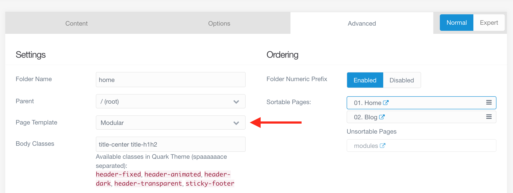

Unfortunately there is one issue we will have to deal with. Because the page was originally using the default template, it is not setup properly. Looking at the Content tab, there is a section below Page Media called Modular Setup. It looks like it should, with `@self.modular` in the Items box. This is what we want.

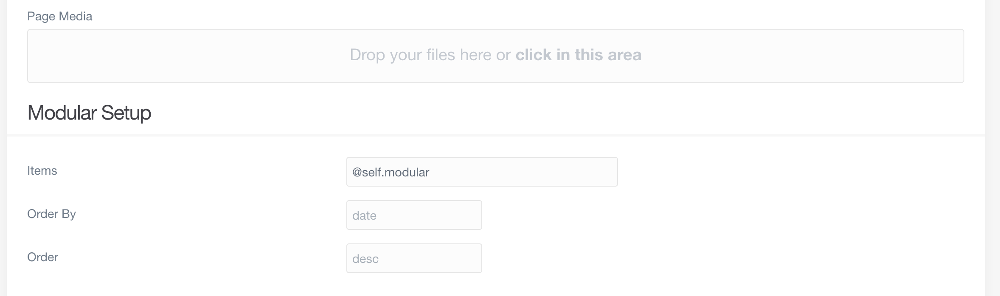

Switch to expert mode and take a look at the frontmatter:

```yaml
title: Home
body_classes: 'title-center title-h1h2'
```

The Items option has not been set. That is a problem, because without it the modules we create will not show up on the page. Fortunately the fix is not very involved. Back in normal mode, make sure to click on the box with your cursor and then save. Nothing else is required. If you switch to expert mode, you should now see this in the frontmatter:

```yaml
title: Home
content:
    items: '@self.modular'
body_classes: 'title-center title-h1h2'
```

This is a potential issue any time we change the template of a page. Although the fields in the editor's normal mode will typically auto-fill, they may not actually be set in the frontmatter. Clicking on the field before saving can fix that by making sure the admin panel registers that the field needs to be set.

## Hero Module

In the Quark theme, there are three types of modular templates: Hero, Features, and Text. You may recall the term 'hero' from working on the Blog page. A hero is essentially a large image with text on top. The Blog template has a hero header built in, which the content goes on top of. The Modular template does not, so if we want a hero-style header, we will have to add one.

If we try to add the page as normal, none of the three modular templates I mentioned are options. Instead, we have to go click the down arrow next to the **Add** button and choose _Add Modular_.

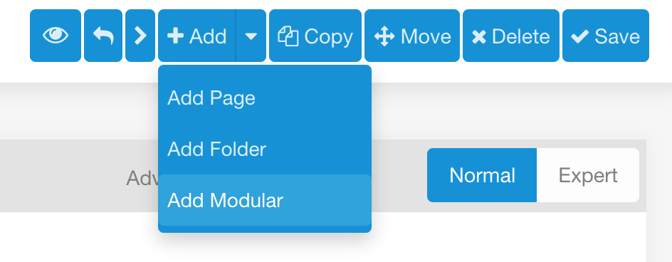

Because this module is going to become our header, it may be tempting to use _header_ as the title. Unfortunately, this will create issues within the template, because there is already a section called _header_. We do not want this to overwrite that, or we will lose our navigation bar!

!!! Author's note: I speak from experience about overwriting the navigation bar. It is almost embarrassing how long it took me to figure out why I had no navigation.

Make sure that the page this module belongs to is _Home_ and select the Modular Template _Hero_.

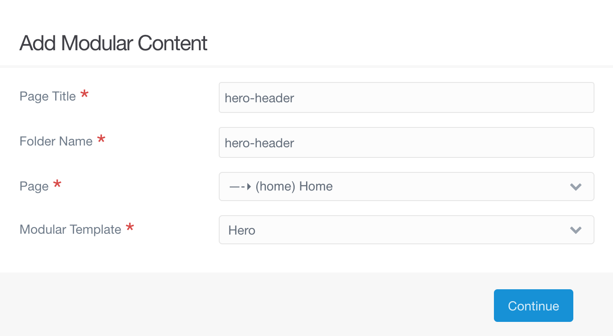

Although the automatic folder name does not show an underscore at the front, there is no need to worry. When the folder is created it will have an underscore.

### Ordering

Before we add any content we should go ahead and make certain that any modules we create will be shown in the correct order. This can be done using numeric folder prefixes.

!!!! For more information about file structures and ordering pages a mini tutorial is in development.

The _Ordering_ section can be found in the right column on the _Advanced_ tab. Because _Folder Numeric Prefix_ is current disabled, _hero-header_ is listed under _Unsortable Pages_.


Toggle prefix setting to Enabled and then save. Once the page has saved _hero-header_ will move to Sortable Pages as _01.hero-header_. Once we have created other modules with numeric prefixes this section will have a list that we can drag and drop to change the order of.

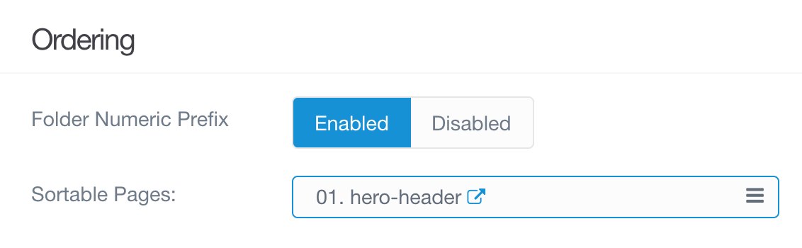

### Content

Now we can add some content. Because whatever we add will be displayed on top of the image we will upload, we do not want to write too much. I will settle for providing a title and subtitle:

```md
# Grav Demo Blog

### Theo Acker
```

I will also upload the snowflakes image from the [tutorial album](https://www.flickr.com/photos/theodwynn/albums/72157712814676952).

!!! The album is referenced in the base tutorial under **[Adding Media](https://www.ds-tutorials.oucreate.com/grav/base-tutorial/creating-content/adding-media)**.

While we do not _have_ to set this image as the hero image, it is good practice. We will also want to add the hero classes `CLIP: text-light overlay-dark-gradient`.

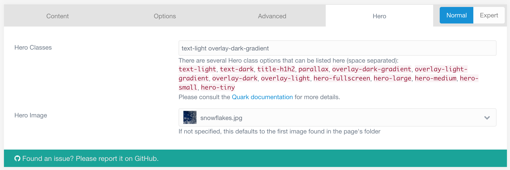

After doing all of this:

[ui-browser address="https://www.ds-tutorials.oucreate.com/grav-demo"]
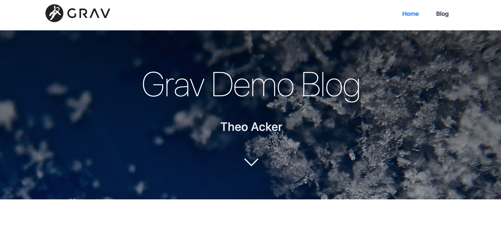
[/ui-browser]

## Text Module

1. Add new modular page
 - Call it "About"
 - Root should be home
 - Use Text

2. enable numeric prefix (and save)
3. Note the new section for image position:


4. I will use a photo of myself. You can use one of the photos from the flickr album or your own
5. Put whatever text you like. If you can't think of anything consider using a lorem ipsum generator. (link)

## Features Module

1. add modular page called Interests using the Features template
2. Enable numeric prefix (and save)
3. Can add some content that will go above the features

```md
## Interests
```

4. Go to the Features tab (can choose standard instead of the small option)

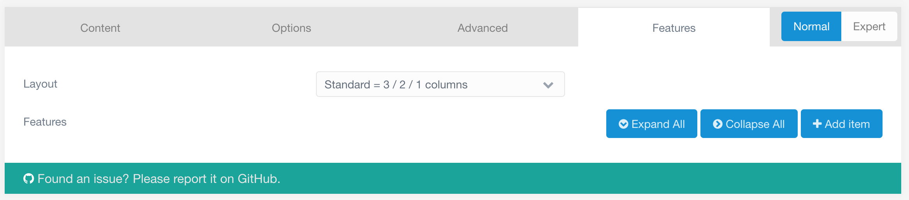

5. For each feature use the **Add Item** button on the right
6. Can pick a font awesome icon to use

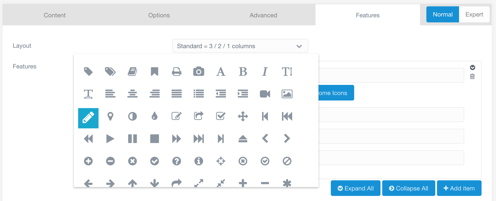

7. I am just using an icon and a header. You can experiment with text and links, however.
8. The features are drag and drop, so don't worry if the order isn't exactly what you want to start with.

## Fixing the Navigation

As with the [one-page site example](https://demo.getgrav.org/onepage-skeleton/), the navigation bar at the top of the site references the modular pages we have added, rather than the rest of the website's pages.

If this were a one-page website:

We can start by changing how the pages appear on the navigation menu. This is easily done in the page editor on the Advanced tab. I would like the header to be referred to as "Top" in the navigation bar, but I really don't want to change the title of the page to Top. Setting the _Menu_ field to Top allows me to do this.

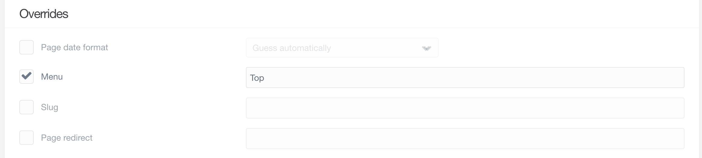

After changing the Menu fields of the other pages, the navigation bar looks like this.


That's very nice and all, but this is not a one-page website. It would be more helpful for the navigation bar to help navigate the rest of the site. To do this we can go to the modular page (Home) and switch the editor to expert mode. In the frontmatter, we than have to type:

```yaml
onpage_menu: false
```

That is all it takes. The navigation bar should now look how we want it.

[ui-browser address="http://ds-tutorials.oucreate.com/grav-demo"]
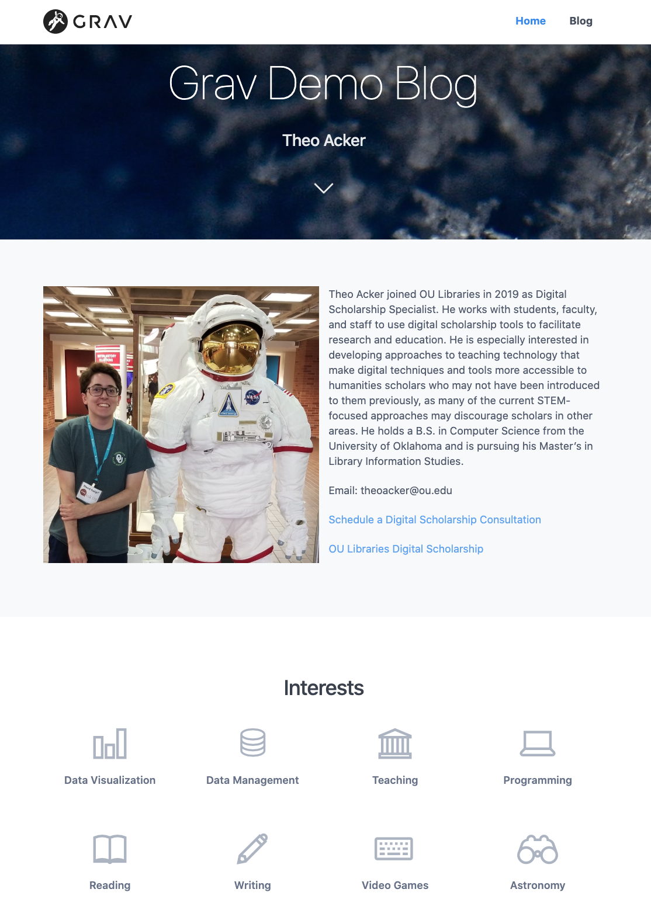
[/ui-browser]